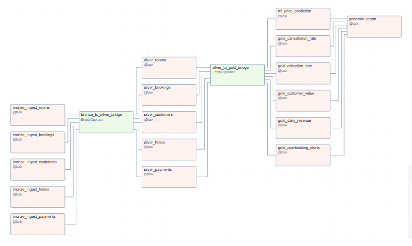
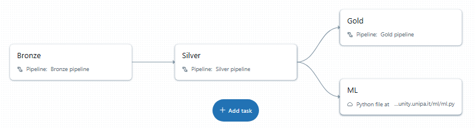
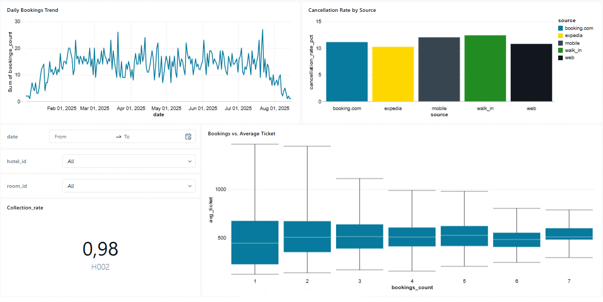
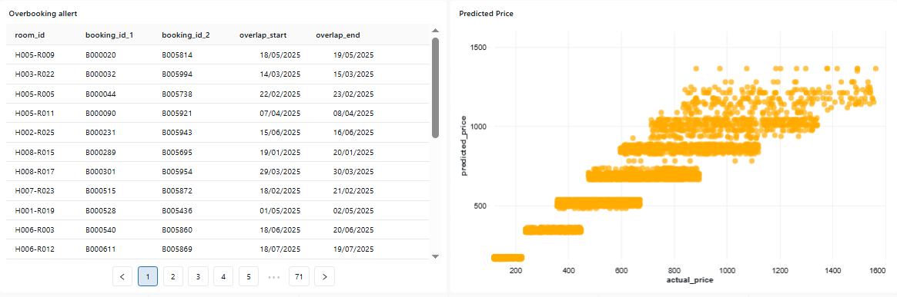

# GlobalStay Data Engineering Project

## Descrizione
Il progetto **GlobalStay** implementa un flusso **ETL end-to-end** per la gestione e l’analisi dei dati di prenotazioni alberghiere per una catena ipotetica chiamata **GlobalStay**.  

Sono state realizzate due versioni parallele:

1. **[Airflow](airflow/README.md)** – Pipeline orchestrata su VM con dati gestiti su **Azure Blob Storage**.  
2. **[Databricks](databricks/README.md)** – Pipeline con **Delta Live Tables (DLT)** su Databricks Free Edition, con dati gestiti tramite **cataloghi, schemi e volumi**.

Entrambe le versioni seguono lo schema architetturale: 
- Bronze → Silver → Gold  
- ML (modello di previsione)  
- Report/Dashboard  

---

## Struttura della repository

```
/data/ # Dataset di input (CSV originali)
├── hotels.csv
├── rooms.csv
├── customers.csv
├── bookings.csv
└── payments.csv

/images/ # Screenshot
├── airflow_dag.png # DAG Airflow (overview)
├── databricks_job.png # Job Databricks con task pipeline + ML
├── kpi_dashboard_1.png # Prima parte della dashboard KPI su Databricks
└── kpi_dashboard_2.png # Seconda parte della dashboard KPI su Databricks

/airflow/ # Implementazione con Apache Airflow
├── dags/
│ └── globalstay/
│ ├── init.py 
│ ├── dag_globalstay_etl.py 
│ ├── bronze.py
│ ├── silver.py 
│ ├── gold.py 
│ ├── ml.py 
│ ├── report.py 
│ └── azure_utils.py
├── README.md # Documentazione dedicata alla versione Airflow

/reports/ # Output report (Airflow)
└── final_report.html 

/databricks/ # Implementazione con Databricks
├── pipelines/
│ ├── bronze.py 
│ ├── silver.py 
│ ├── gold.py 
├── ml/
│ └── ml.py 
├── dashboards/
│ └── kpi_dashboard.json 
├── README.md # Documentazione dedicata alla versione Databricks

README.md # Documentazione principale del progetto
```

---

## Gestione dei dati

- **CSV di input**: presenti nella cartella `data/`.  
- **Airflow**: i CSV vengono caricati su **Azure Blob Storage** (`landing/`) e processati tramite i layer ETL.  
- **Databricks**: i CSV sono caricati nel volume `globalstay.raw.landing` e trasformati in tabelle Delta attraverso pipeline DLT.

---

## Architettura della pipeline

| Layer        | Obiettivo principale                                                                 |
|--------------|--------------------------------------------------------------------------------------|
| **Bronze**   | Ingestione dei dati grezzi con aggiunta di timestamp                                 |
| **Silver**   | Pulizia, deduplicazione e regole di data quality                                     |
| **Gold**     | Calcolo KPI di business: ricavi giornalieri, customer value, collection rate, ecc.   |
| **ML**       | Modello Random Forest per la predizione dei prezzi di prenotazione                   |
| **Report**   | Creazione report HTML (Airflow) o dashboard interattiva (Databricks)                 |

---

## Screenshot e report

- **DAG overview (Airflow):**  
  

- **Job orchestrato (Databricks):**  
  

- **Gold KPI Dashboard (Databricks):**
   
  
  

- **Report HTML:**  
  [Apri report](reports/globalstay_report.html)


---

## Come utilizzare la repository

1. **Clonare il repository**  
   ```bash
   git clone https://github.com/AntoninoMaenza/GlobalStay-Data-Engineering-Project.git
   cd globalstay
---
2. **Airflow** 

- Seguire le istruzioni dettagliate in **[Airflow](airflow/README.md)**.
---
3. **Databricks**

- Seguire le istruzioni dettagliate in **[Databricks](databricks/README.md)**.


