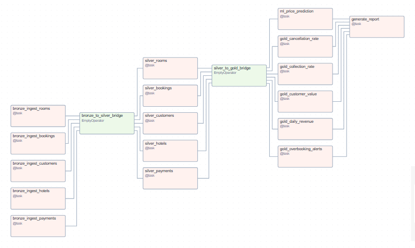

# Airflow Version – GlobalStay Data Engineering Project

## Scopo

Questa parte del progetto implementa la pipeline ETL tramite **Apache Airflow**, orchestrata su macchina virtuale con dati gestiti su **Azure Blob Storage**. Il flusso prevede i seguenti livelli:

- Bronze → Silver → Gold  
- ML (modello di previsione)  
- Report finale in HTML  

## Struttura dei file
```
airflow/
├── dags/globalstay/
│ ├── dag_globalstay_etl.py # Definizione del DAG con orchestrazione dei layer
│ ├── __init__.py # Rende la cartella un package Python (necessario per import relativi)
│ ├── bronze.py # Task di ingestione dati grezzi
│ ├── silver.py # Pulizia, validazione, deduplicazione
│ ├── gold.py # Calcolo dei KPI business
│ ├── ml.py # Addestramento modello e previsione
│ ├── report.py # Generazione report HTML
│ └── azure_utils.py # Funzioni helper per upload/download da Azure Blob Storage
```


---

## Setup

1. **Connection in Airflow**  
   Creare una connection con:
   - Conn Id: `azure_blob_storage`
   - Tipo: *Generic (Azure)*
   - Extra (JSON):
     ```json
     {
       "connection_string": "DefaultEndpointsProtocol=https;AccountName=<ACCOUNT_NAME>;AccountKey=<ACCOUNT_KEY>;EndpointSuffix=core.windows.net"
     }
     ```

2. **Dati di input**  
   Caricare i file CSV grezzi nella cartella `landing/` del container Azure Blob.

3. **DAG**  
   Copiare la cartella `airflow/dags/globalstay/` nella directory `dags/` della tua installazione Airflow.

4. **Avvio**  
   Abilitare il DAG `globalstay_etl_pipeline` dall’interfaccia web di Airflow.

---

## Requisiti

- **Python ≥ 3.8**  
- **Apache Airflow**  
- Librerie Python:
  - `pandas`
  - `azure-storage-blob`
  - `joblib`
  - `scikit-learn`
  - `matplotlib`, `seaborn`

---

## Architettura della pipeline

Il DAG è schedulato **giornalmente (`@daily`)**.  
La sequenza di esecuzione è la seguente:  
  

### Nota sugli `EmptyOperator`
Il DAG utilizza due `EmptyOperator` come **bridge** tra i layer per rendere chiara l’orchestrazione:

- **bronze_to_silver_bridge** → assicura che tutti i task Bronze terminino prima di avviare i Silver.  
- **silver_to_gold_bridge** → separa i task Silver (pulizia/validazione) da Gold e ML.  

Questa scelta migliora la leggibilità del DAG e la gestione delle dipendenze.

---

## Funzionalità principali

### Bronze Layer
- Task di ingestione multipli:
  - `bronze_ingest_hotels`  
  - `bronze_ingest_rooms`  
  - `bronze_ingest_customers`  
  - `bronze_ingest_bookings`  
  - `bronze_ingest_payments`  
- Lettura da `landing/`  
- Aggiunta colonna `ingestion_date`  
- Scrittura in `bronze/`

### Silver Layer
- **Hotels**: esclusione record con `country = 'XX'`  
- **Customers**: email vuote → `NULL`, deduplicazione su `customer_id`  
- **Rooms**: deduplicazione su `room_id`  
- **Bookings**: correzione date incoerenti, validazione valute, `total_amount` negativo → `NULL`  
- **Payments**: flag `orphan` e `over_amount`, normalizzazione valute  

### Gold Layer
- **Daily Revenue**: ricavi giornalieri per data check-in  
- **Cancellation Rate**: tasso di cancellazione per source  
- **Collection Rate**: incassato vs prenotato per hotel  
- **Overbooking Alerts**: rilevamento prenotazioni sovrapposte per camera  
- **Customer Value**: numero prenotazioni, ricavi totali, ticket medio  

### ML Layer
- Modello **Random Forest Regressor** per predizione prezzi  
- Feature engineering su durata soggiorno, occupazione massima, tipologia camera, stagione, weekend  
- Output:
  - Tabella `gold/predicted_price.csv` con prezzo reale vs predetto  
  - Modello serializzato `models/price_prediction_model.pkl`  

### Report Layer
- Generazione di un **report HTML statico** [(`reports/final_report.html`)](../reports/final_report.html)  
- Include:
  - Top 10 clienti per revenue  
  - Overbooking alerts  
  - Collection rate per hotel  
  - Cancellation rate per source  
  - Daily revenue trend  
  - Confronto prezzo reale vs predetto  
- Grafici realizzati con **Matplotlib** e **Seaborn**

---

## Struttura del container Azure Blob


```
globalstay/
│
├── landing/          # dati raw di partenza (CSV iniziali: hotels.csv, rooms.csv, customers.csv, bookings.csv, payments.csv)
├── bronze/           # dati ingeriti con timestamp e senza trasformazioni
├── silver/           # dati puliti e normalizzati
├── gold/             # KPI e tabelle derivate pronte all'uso
├── models/           # modelli ML salvati in formato .pkl
└── reports/          # report HTML generati dalla pipeline
```

---

## Output finale

- **Tabelle Gold** aggiornate con KPI e predizioni  
- **Modello ML** salvato su Azure Blob (`models/price_prediction_model.pkl`)  
- **Report HTML** con KPI e grafici (`reports/final_report.html`)

---


