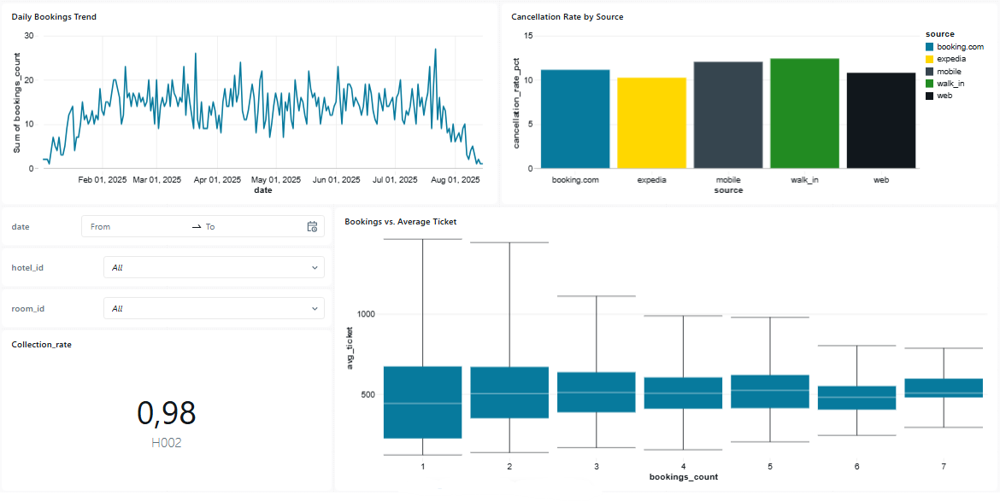

# Databricks Version – GlobalStay Data Engineering Project

## Scopo

Questa parte del progetto implementa la pipeline ETL tramite **Databricks Free Edition**, utilizzando:

* **Delta Live Tables (DLT)** per l’ingestione e la trasformazione dei dati
* **Job Databricks** per l’orchestrazione dei task
* **Dashboard** per la visualizzazione dei KPI

Il flusso prevede i seguenti livelli:

- Bronze → Silver → Gold
- ML (modello di previsione)
- Report finale in HTML

---

## Struttura dei file

 ```
/databricks/              # Implementazione Databricks
├── pipelines/
│   ├── bronze.py         # Ingestion dati raw → Bronze layer
│   ├── silver.py         # Pulizia e trasformazioni → Silver layer
│   ├── gold.py           # KPI e tabelle finali → Gold layer
├── ml/
│   └── ml.py             # Script ML per training/predizione
├── dashboards/
│   └── kpi_dashboard.json  # Export dashboard Databricks
└── README.md             # Documentazione
 ```


---

## Setup

1. **Catalogo e schemi**

   Creare il catalogo e gli schemi con le seguenti query SQL:

   ```sql
   DROP CATALOG IF EXISTS globalstay CASCADE;
   CREATE CATALOG IF NOT EXISTS globalstay;

   CREATE SCHEMA IF NOT EXISTS globalstay.raw;
   CREATE VOLUME IF NOT EXISTS globalstay.raw.landing;

   CREATE SCHEMA IF NOT EXISTS globalstay.bronze;
   CREATE SCHEMA IF NOT EXISTS globalstay.silver;
   CREATE SCHEMA IF NOT EXISTS globalstay.gold;
   ```

2. **Caricamento dati**

   Caricare i file CSV nel volume `globalstay.raw.landing`.

3. **Creazione Job**

   Configurare un Job con 4 task:

   * **Bronze** (pipeline DLT) → esegue `bronze.py`  
   * **Silver** (pipeline DLT) → esegue `silver.py`  
   * **Gold** (pipeline DLT) → esegue `gold.py`  
   * **ML** (script) → esegue `ml.py` (dipendente dal task *Silver*)

4. **Dashboard**

   * Creare una nuova **Dashboard** in Databricks
   * Collegarla alle tabelle Gold (`globalstay.gold.*`) e alla tabella `globalstay.gold.predicted_prices`
   * (Opzionale) Importare il file JSON della dashboard disponibile in `dashboards/`

---

## Requisiti

* **Databricks Free Edition**
* Runtime Spark con **Delta Lake** abilitato
* Librerie Python installate:

  * `pandas`
  * `numpy`
  * `scikit-learn`
  * `joblib`

---

## Architettura della pipeline

Il Job orchestrato su Databricks contiene 4 task principali:


* **Bronze** → ingestione CSV dal volume `landing/` in `globalstay.bronze`
* **Silver** → pulizia, normalizzazione e applicazione delle regole di data quality
* **Gold** → calcolo KPI:

  * Daily Revenue
  * Customer Value
  * Collection Rate
  * Overbooking Alerts
  * Cancellation Rate
* **ML** → addestramento modello Random Forest per la predizione del prezzo delle prenotazioni

  * Output: tabella `globalstay.gold.predicted_prices`
  * Modello `.pkl` salvato nel workspace

---

## Dashboard

La dashboard costruita in Databricks si basa sul contenuto delle tabelle **Gold** e include le seguenti visualizzazioni:

1. **Daily Bookings Trend** *(line chart)*

   * Mostra l’andamento giornaliero delle prenotazioni e dei ricavi.
   * Colonne utilizzate: `date`, `bookings_count`.
   * **Filtro**: `date`.

2. **Cancellation Rate by Source** *(bar chart)*

   * Percentuale di cancellazioni suddivisa per canale di prenotazione.
   * Colonne utilizzate: `source`, `cancellation_rate_pct`.

3. **Collection Rate** *(counter)*

   * Rapporto tra incassi e valore totale prenotazioni.
   * Colonne utilizzate: `collection_rate`.
   * **Filtro**: `hotel_id`.

4. **Bookings vs. Average Ticket** *(boxplot)*

   * Analisi del valore medio della prenotazione per cliente.
   * Colonne utilizzate: `bookings_count`, `avg_ticket`.

5. **Overbooking Alerts** *(table)*

   * Elenco delle prenotazioni con camere sovrapposte.
   * Colonne utilizzate: `room_id`, `booking_id_1`, `booking_id_2`, `overlaps_start`, `overlaps_end`.
   * **Filtro**: `room_id`.

6. **Predicted Price** *(scatter plot)*

   * Visualizza i valori previsti dal modello di regressione.
   * Colonne utilizzate: `predicted_price`, `actual_price`.

-----

> ⚠️ **Nota:** La **Free Edition di Databricks** non consente l'esportazione delle dashboard in formato PDF. Per la documentazione, sono stati inclusi degli **screenshot** e il **file JSON** della dashboard, disponibile in `dashboards/globalstay_dashboard.json`, che può essere importato per replicare la visualizzazione.

-----
**Gold KPI Dashboard:**  
  
  
---

## Output finale

* **Tabelle Delta Gold** con KPI e predizioni
* **Modello ML** salvato nel workspace Databricks (`.pkl`)
* **Dashboard interattiva** in SQL Workspace con analisi dei KPI principali


